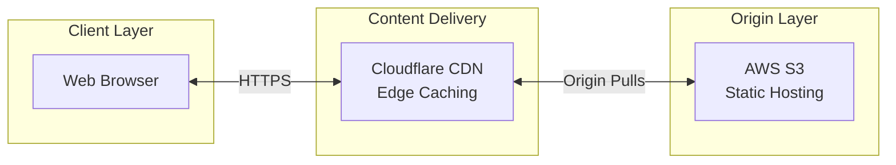
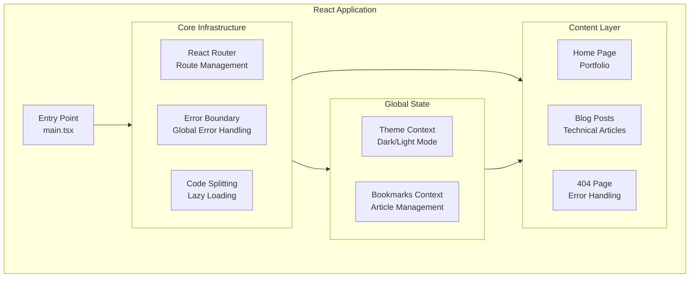

# RayPerez.com

A personal portfolio and technical blog built with React, TypeScript, and Vite.

[](coverage)

## 🚀 Features

- **Professional Portfolio**: Showcases experience, education, skills, and achievements
- **Technical Blog**: In-depth articles on various technologies (NestJS, GraphQL, React, etc.)
- **Modern UI**: Clean, responsive design using Material UI
- **Performance Optimized**: Implements code splitting, lazy loading, and optimized bundling
- **SEO Friendly**: Schema.org structured data and meta tags for better search engine visibility

## 🏗️ System Architecture

### Infrastructure Overview



### Application Architecture



The first diagram shows how user requests flow through the system. The second diagram shows how the React application is organized internally.

## 🛠️ Technologies

- **React** with TypeScript
- **Vite** for fast builds and development
- **Material UI** for component styling
- **React Router** for navigation
- **React Helmet** for document head management
- **React Schema.org** for structured data
- **Marked** for markdown rendering
- **React Syntax Highlighter** for code blocks

## 📋 Prerequisites

- Node.js
- npm or yarn

## ⚙️ Installation

1. Clone the repository:

   ```bash
   git clone https://github.com/yourname/rayperez-site.git
   cd rayperez-site
   ```

2. Install dependencies:

   ```bash
   npm install
   # or
   yarn
   ```

3. Start the development server:

   ```bash
   npm run dev
   # or
   yarn dev
   ```

4. Open http://localhost:5173 in your browser

## 📁 Project Structure

```
rayperez-site/
├── dist/                 # Production build output
├── public/               # Static assets served as-is
├── src/
│   ├── assets/           # Images and project assets
│   ├── components/       # Reusable UI components
│   ├── constants/        # App constants and configuration
│   ├── contexts/         # React contexts (theme, bookmarks)
│   ├── data/
│   │   ├── articles/     # JSON-driven article content
│   │   └── content/      # Structured site content (profile, projects, experiences, etc.)
│   ├── hooks/            # Custom React hooks
│   ├── img/              # Legacy/static images
│   ├── pages/
│   │   └── articles/     # Blog article page wrappers
│   ├── test-utils/       # Testing helpers and providers
│   ├── types/            # Shared TypeScript types
│   ├── utils/            # Utility functions
│   ├── App.tsx           # Main app component
│   ├── main.tsx          # Application entry point
│   ├── setupTests.ts     # Vitest + RTL setup
│   └── vite-env.d.ts     # Vite TS types
├── scripts/              # Build/automation scripts
├── docs/                 # Documentation and ADRs
├── infrastructure/       # Terraform/infra as code
├── coverage/             # Test coverage reports
├── index.html            # Root HTML template
├── package.json          # Scripts and dependencies
├── tsconfig.json         # TypeScript configuration
├── vite.config.ts        # Vite configuration
├── vitest.config.ts      # Vitest configuration
├── CONTRIBUTING.md       # Contributing guidelines
├── CHANGELOG.md          # Changelog
├── LICENSE               # License
└── README.md             # Project overview
```

## 🔧 Development

### Available Scripts

- `npm run dev` - Start development server
- `npm run build` - Build for production
- `npm run preview` - Preview production build
- `npm run lint` - Run ESLint
- `npm run format` - Format code with Prettier

### Code Style

This project uses ESLint and Prettier for code quality and formatting:

```bash
# Format all files
npm run format

# Lint check
npm run lint
```

### Testing

This project enforces a minimum 70% code coverage threshold. Tests are run using Vitest and React Testing Library.

To run tests:

```bash
npm test
```

To run tests with coverage:

```bash
npm run test:coverage
```

## 🚀 Deployment

1. Create a production build:

   ```bash
   npm run build
   ```

2. The build output will be in the `dist` directory, which can be deployed to any static hosting service like:
   - Netlify
   - Vercel
   - GitHub Pages
   - AWS S3

## 🔄 Performance Optimizations

- **Code Splitting**: All article pages are lazy-loaded
- **Bundle Optimization**: Manual chunk splitting in Vite config
- **Preloading**: Strategic preloading of important routes
- **Tree Shaking**: Dead code elimination in production builds

## ✍️ Articles are JSON-Driven

- Article content lives in `src/data/articles/*.json` and follows `ArticleDocument` schema.
- Pages import JSON and render via `JsonBlogPost`, which uses `ArticleRenderer`.
- Example:

```tsx
import JsonBlogPost from '../../components/JsonBlogPost'
import { ArticleDocument } from '../../types/articleContent'
import content from '../../data/articles/WhyReactJS.json'

export default function WhyReactJS() {
  return (
    <JsonBlogPost
      title='Why I Choose React'
      author='Raymond Perez'
      date='2024-07-04'
      content={content as ArticleDocument}
    />
  )
}
```

## 📊 Content Data

Site content (profile, projects, achievements, experiences, education) is stored in structured JSON files in `src/data/content/`. These files serve as the **source of truth** for site content and are:

- **Version-controlled**: All content changes are tracked in Git
- **Type-safe**: Validated against TypeScript interfaces in `src/types/contentData.ts`
- **Automatically validated**: CI pipeline runs validation tests on every push and pull request
- **Consistently consumed**: Components read directly from these files

For detailed workflow instructions on updating content data, see the [Content Flow section](CONTRIBUTING.md#content-flow) in CONTRIBUTING.md.

## 🧰 SEO Features

- **Structured Data**: Schema.org markup for better search indexing
- **Meta Tags**: Dynamic meta tags with React Helmet
- **Canonical URLs**: Proper handling of canonical URLs

## 📝 License

This project is licensed under the MIT License - see the LICENSE file for details.

## 📚 Documentation

- [Contributing Guidelines](CONTRIBUTING.md) - How to contribute to the project
- [Release Process](docs/RELEASE_PROCESS.md) - Release workflow and versioning

## 🤝 Contact

Raymond Perez:

- [GitHub](https://github.com/rspraymond)
- [LinkedIn](https://www.linkedin.com/in/raymond-perez-eng/)
- [Twitter](https://twitter.com/onlyray7)
