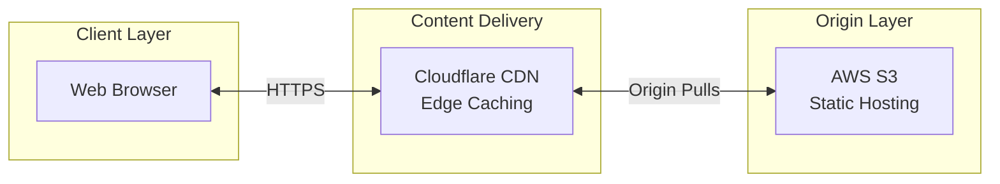
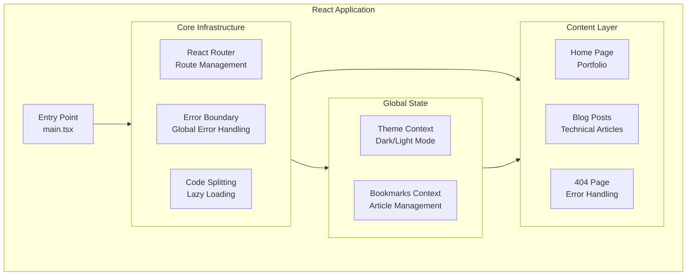

# RayPerez.com

A personal portfolio and technical blog built with React, TypeScript, and Vite.

## 🚀 Features

- **Professional Portfolio**: Showcases experience, education, skills, and achievements
- **Technical Blog**: In-depth articles on various technologies (NestJS, GraphQL, React, etc.)
- **Modern UI**: Clean, responsive design using Material UI
- **Performance Optimized**: Implements code splitting, lazy loading, and optimized bundling
- **SEO Friendly**: Schema.org structured data and meta tags for better search engine visibility

## 🏗️ System Architecture

### Infrastructure Overview



### Application Architecture



The first diagram shows how user requests flow through the system. The second diagram shows how the React application is organized internally.

## 🛠️ Technologies

- **React** with TypeScript
- **Vite** for fast builds and development
- **Material UI** for component styling
- **React Router** for navigation
- **React Helmet** for document head management
- **React Schema.org** for structured data
- **Marked** for markdown rendering
- **React Syntax Highlighter** for code blocks

## 📋 Prerequisites

- Node.js
- npm or yarn

## ⚙️ Installation

1. Clone the repository:

   ```bash
   git clone https://github.com/yourname/rayperez-site.git
   cd rayperez-site
   ```

2. Install dependencies:

   ```bash
   npm install
   # or
   yarn
   ```

3. Start the development server:

   ```bash
   npm run dev
   # or
   yarn dev
   ```

4. Open http://localhost:5173 in your browser

## 📁 Project Structure

```
rayperez-site/
├── dist/                 # Build output
├── public/               # Static assets
├── src/
│   ├── assets/           # Images and other assets
│   ├── components/       # Reusable components
│   ├── pages/            # Page components
│   │   └── articles/     # Blog article pages
│   ├── App.tsx           # Main app component
│   ├── main.tsx          # Entry point
│   └── ...
├── package.json          # Dependencies and scripts
├── tsconfig.json         # TypeScript configuration
├── vite.config.ts        # Vite configuration
└── ...
```

## 🔧 Development

### Available Scripts

- `npm run dev` - Start development server
- `npm run build` - Build for production
- `npm run preview` - Preview production build
- `npm run lint` - Run ESLint
- `npm run format` - Format code with Prettier

### Code Style

This project uses ESLint and Prettier for code quality and formatting:

```bash
# Format all files
npm run format

# Lint check
npm run lint
```

## 🚀 Deployment

1. Create a production build:

   ```bash
   npm run build
   ```

2. The build output will be in the `dist` directory, which can be deployed to any static hosting service like:
   - Netlify
   - Vercel
   - GitHub Pages
   - AWS S3

## 🔄 Performance Optimizations

- **Code Splitting**: All article pages are lazy-loaded
- **Bundle Optimization**: Manual chunk splitting in Vite config
- **Preloading**: Strategic preloading of important routes
- **Tree Shaking**: Dead code elimination in production builds

## 🧰 SEO Features

- **Structured Data**: Schema.org markup for better search indexing
- **Meta Tags**: Dynamic meta tags with React Helmet
- **Canonical URLs**: Proper handling of canonical URLs

## 📝 License

This project is licensed under the MIT License - see the LICENSE file for details.

## 🤝 Contact

Raymond Perez:

- [GitHub](https://github.com/rspraymond)
- [LinkedIn](https://www.linkedin.com/in/raymond-perez-eng/)
- [Twitter](https://twitter.com/onlyray7)

## Testing

[](coverage)

This project enforces a minimum 70% code coverage threshold. Tests are run using Vitest and React Testing Library.

To run tests:

```bash
npm test
```

To run tests with coverage:

```bash
npm run test:coverage
```
