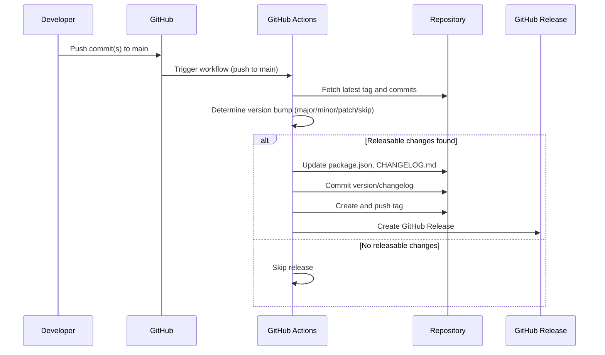
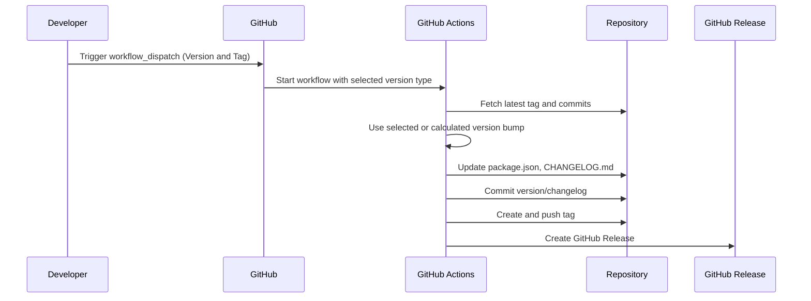

# Release Process

This document outlines the release process. The project uses automated workflows for versioning, changelog generation, and release creation, with manual processes available when needed.

## Table of Contents

- [Overview](#overview)
- [Pre-Release Checklist](#pre-release-checklist)
- [Automated Release Process](#automated-release-process)
- [Manual Release Process](#manual-release-process)
- [Version Management](#version-management)
- [Changelog Management](#changelog-management)
- [Post-Release Tasks](#post-release-tasks)
- [Troubleshooting](#troubleshooting)

## Overview

The release process follows semantic versioning (SemVer) principles:

- **Major** (X.0.0): Breaking changes that require user action
- **Minor** (0.X.0): New features that are backward compatible
- **Patch** (0.0.X): Bug fixes and backward-compatible improvements

Releases are typically automated through GitHub Actions, but manual processes are available for special cases.

## Pre-Release Checklist

Before initiating a release, verify the following:

### Code Quality

- [ ] All tests pass (`npm test`)
- [ ] Code coverage meets minimum threshold (70%)
- [ ] Linting passes (`npm run lint`)
- [ ] Code is formatted (`npm run format`)

### Documentation

- [ ] README.md is up to date
- [ ] CONTRIBUTING.md reflects current practices
- [ ] New features are documented
- [ ] API changes are documented (if applicable)

### Dependencies

- [ ] All dependencies are up to date
- [ ] Security vulnerabilities are addressed
- [ ] No deprecated packages are in use

### Content

- [ ] Recent posts are added to the posts list in `RecentPosts.tsx`
- [ ] Sitemap is current (`npm run generate-sitemap`)
- [ ] All links are working
- [ ] SEO metadata is correct

## Automated Release Process

**Event Sequence Diagram: Automated Release (Push to main)**



The automated release process triggers on pushes to the main branch and handles:

1. **Version Detection**: Analyzes commits since the last tag
2. **Version Bumping**: Determines appropriate version increment
3. **Changelog Generation**: Creates changelog entries from commits
4. **Tag Creation**: Creates and pushes version tags
5. **GitHub Release**: Creates a GitHub release with changelog

### How Version Bumping Works

The automated process determines version bumps based on commit types:

- **Major**: Commits with `!` or `BREAKING CHANGE` in the message
- **Minor**: Commits with type `feat`
- **Patch**: Commits with type `fix`, `perf`, or other types

### Commit Types That Trigger Releases

- `feat`: New features (minor version bump)
- `fix`: Bug fixes (patch version bump)
- `perf`: Performance improvements (patch version bump)
- `!` or `BREAKING CHANGE`: Breaking changes (major version bump)

### Skipping Releases

The automated process skips releases when:

- The last commit is already a version bump
- No releasable changes are found (only `chore`, `docs`, `style`, `refactor`, `test` commits)

## Manual Release Process

**Event Sequence Diagram: Manual Release (Workflow Dispatch)**



Use manual releases for:

- Emergency hotfixes
- When automated process fails
- Special release scenarios
- Pre-release testing

### Manual Version Bump

1. **Navigate to Actions**: Go to GitHub Actions → Version and Tag
2. **Trigger Workflow**: Click "Run workflow"
3. **Select Version Type**: Choose major, minor, or patch
4. **Execute**: Click "Run workflow"

The workflow will:

- Update package.json version
- Generate changelog
- Create and push tag
- Create GitHub release

### Manual Changelog Update

1. **Navigate to Actions**: Go to GitHub Actions → Update Changelog
2. **Trigger Workflow**: Click "Run workflow"
3. **Optional Version**: Enter specific version (optional)
4. **Execute**: Click "Run workflow"

This updates CHANGELOG.md without creating a new release.

## Version Management

### Current Version

The current version is stored in `package.json`:

```json
{
  "version": "0.3.2"
}
```

### Version History

Version history is maintained in:

- `CHANGELOG.md`: Detailed change log
- Git tags: Version tags (e.g., `v0.3.2`)
- GitHub releases: Release notes and assets

### Version Naming Convention

- Tags: `vX.Y.Z` (e.g., `v0.3.2`)
- Releases: `Release vX.Y.Z`
- Branches: `release/vX.Y.Z` (for manual releases)

## Changelog Management

### Automatic Generation

The changelog is automatically generated from conventional commits using `scripts/generate-changelog.ts`.

### Changelog Structure

```markdown
## [Version] - YYYY-MM-DD

### Features

- New feature description

### Bug Fixes

- Bug fix description

### Other Changes

- Other change description
```

### Manual Changelog Updates

To manually update the changelog:

```bash
npm run changelog
```

This generates a changelog entry for unreleased commits.

### Changelog Best Practices

- Keep entries concise and clear
- Reference issue numbers when applicable
- Group changes by type (Features, Bug Fixes, etc.)
- Use consistent formatting

## Post-Release Tasks

After a successful release:

### Verification

- [ ] GitHub release is created correctly
- [ ] Tag is pushed to repository
- [ ] Changelog is updated
- [ ] Version in package.json is correct

### Communication

- [ ] Update any external documentation
- [ ] Notify stakeholders if needed
- [ ] Update deployment references

### Monitoring

- [ ] Monitor for any deployment issues
- [ ] Check for broken links or references
- [ ] Verify site functionality

## Troubleshooting

### Common Issues

#### Release Workflow Fails

**Problem**: Automated release workflow fails
**Solution**:

1. Check workflow logs for specific errors
2. Verify commit message format
3. Ensure proper permissions are set
4. Use manual release process if needed

#### Version Conflicts

**Problem**: Version mismatch between package.json and git tags
**Solution**:

1. Check current version: `node -p "require('./package.json').version"`
   or open `package.json` and check the "version" field
2. Verify latest tag: `git describe --tags --abbrev=0`
3. Manually sync if needed

#### Changelog Not Updated

**Problem**: Changelog doesn't reflect recent changes
**Solution**:

1. Run manual changelog generation
2. Verify commit messages follow conventional format
3. Check for merge commits that might interfere

#### Tag Push Fails

**Problem**: Git tag push fails
**Solution**:

1. Verify repository permissions
2. Check for tag conflicts
3. Use manual tag creation if needed

### Emergency Procedures

#### Hotfix Release

For critical bug fixes:

1. Create hotfix branch: `git checkout -b hotfix/vX.Y.Z`
2. Make minimal fix
3. Commit with conventional format
4. Push branch and create PR
5. Merge to main
6. Use manual release process for immediate deployment

#### Rollback Release

If a release causes issues:

1. Revert the release commit
2. Create new patch release
3. Update changelog to reflect rollback
4. Communicate the rollback to users

### Getting Help

If you encounter issues not covered here:

1. Check GitHub Actions logs for detailed error messages
2. Review recent commits for potential issues
3. Consult the project maintainers
4. Check GitHub Issues for similar problems

## Best Practices

### Before Releasing

- Ensure all changes are tested
- Verify documentation is current
- Check for any security issues
- Confirm all automated checks pass

### During Release

- Monitor the release process
- Be prepared to intervene if automation fails
- Keep stakeholders informed of release status

### After Release

- Verify the release was successful
- Monitor for any issues
- Update any external references
- Archive release artifacts if needed

### Commit Message Guidelines

Follow conventional commit format:

```
type(scope): description

[optional body]

[optional footer]
```

Types that trigger releases:

- `feat`: New features
- `fix`: Bug fixes
- `perf`: Performance improvements
- `!` or `BREAKING CHANGE`: Breaking changes

### Release Frequency

- **Patch releases**: As needed for bug fixes
- **Minor releases**: When new features are added
- **Major releases**: When breaking changes are introduced

Aim for regular, predictable releases to maintain user trust and project stability.
